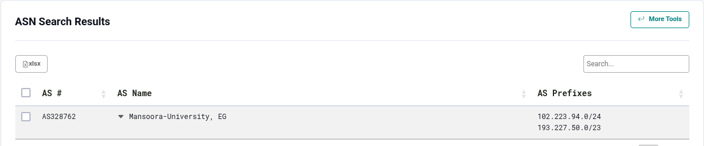
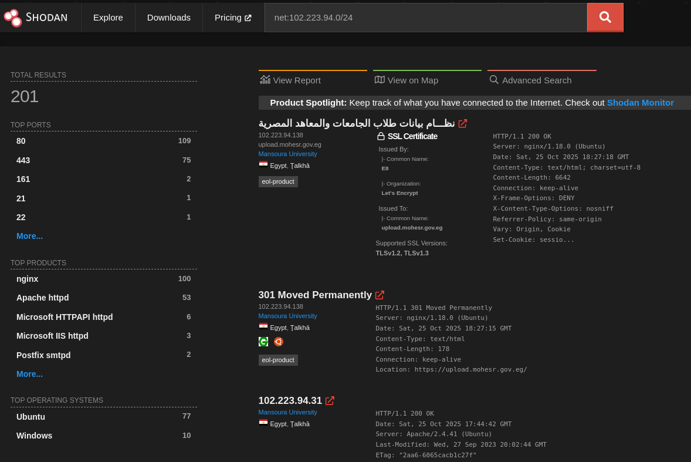
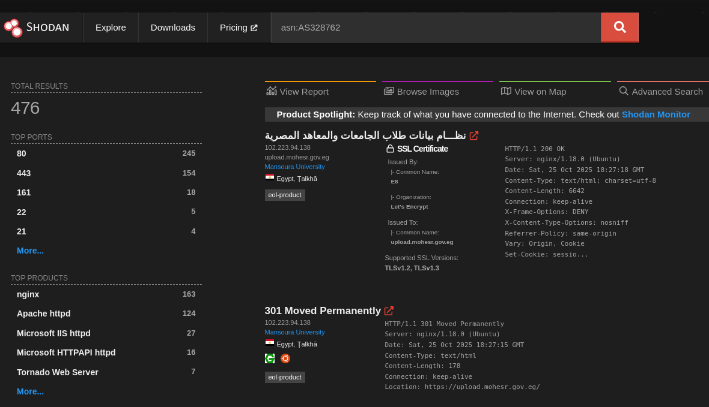
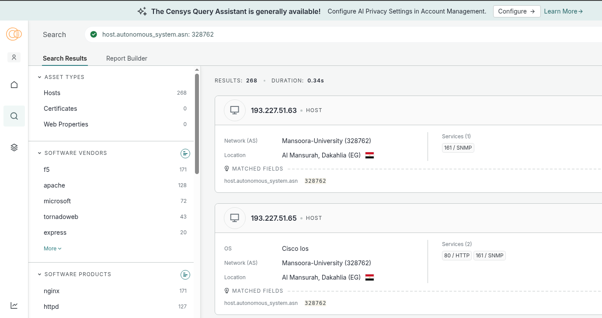

# Passive Information Gathering (OSINT) — Cheatsheet

**Passive Information Gathering**, also called **Open-Source Intelligence (OSINT)**, is the process of collecting openly available information about a target **without direct interaction** with that target. Use passive methods to reduce the chance of detection while gathering useful intelligence. For reference: https://osintframework.com/

---

## DNS fundamentals & common record types
A **DNS record** is like an entry in the internet's address book — it tells clients how to find and connect to a domain. Each record type serves a different purpose.

| Record | Purpose | Example |
|---|---|---|
| **A** | Maps a domain → IPv4 address | `example.com` → `93.184.216.34` |
| **AAAA** | Maps a domain → IPv6 address | `example.com` → `2606:2800:220:1:248:1893:25c8:1946` |
| **CNAME** | Alias (points one name to another) | `www.example.com` → `example.com` |
| **MX** | Mail Exchange (email servers) | `example.com` → `mail.example.com` |
| **NS** | Name Server for the zone | `example.com` → `ns1.dnsprovider.com` |
| **TXT** | Arbitrary text (SPF, DKIM, verification) | `"v=spf1 include:_spf.google.com ~all"` |
| **SOA** | Start of Authority (zone admin, refresh times) | zone metadata (admin email, serial, timers) |
| **PTR** | Reverse DNS (IP → domain) | `8.8.8.8` → `dns.google` |


---

## Quick DNS examples & commands
Check records with `dig` or `nslookup`:

```bash
# A record
dig example.com A
dig example.com A +short

# MX record
dig example.com MX

# NS record
dig example.com NS

# Reverse lookup (PTR)
dig -x 8.8.8.8

# Concise IP output
dig example.com +short

# Query IPv4 & IPv6
dig example.com A AAAA

# nslookup (simple)
nslookup example.com

# host (alternate)
host example.com
```

These commands show the DNS records for that domain.

---

## When PTR is missing — alternatives
Sometimes a reverse PTR record doesn't exist. When that happens, use other passive methods:
- **WHOIS** lookup for owner/registrant info. `whois 102.223.94.154`
- **Passive internet scanners** (e.g., Shodan) to find device/service metadata.
- **Certificate transparency logs** (crt.sh) to discover names tied to TLS certificates.

---

## IP ↔ DNS name relationships
**One IP ↔ many DNS names** (name-based/virtual hosting) is common. Example:
```
93.184.216.34 → example.com
93.184.216.34 → example.net
93.184.216.34 → docs.example.org
```
A single webserver uses the `Host` header to decide which site to serve.

**One domain ↔ many IPs** is also possible (load balancing, redundancy).

**Important:** multiple hostnames pointing to the same IP *does not guarantee* the same owner. Two common cases:

- **Same owner (common):** `example.com` and `shop.example.com` both resolve to `203.0.113.10` and are controlled by the same org.
- **Different owners (also common):** Sites behind CDNs (Cloudflare, Fastly) share IP addresses across unrelated domains.

So: **same IP ≠ same owner**. Always corroborate with WHOIS, TLS certs, hosting provider, and other evidence.
- **Conclusion** `example.com`and`example.org` not the same owner even if they have the same IP ,However, `mail.example.com` is a **subdomain** of `example.com`, meaning they belong to the same owner
---

## Domain vs Subdomain
**Domain** — the primary, unique address for a website you own (e.g., `example.com`). It's used for branding and identity.

**Subdomain** — a prefix added to a domain to create a separate section (e.g., `blog.example.com`). Subdomains help organize content and can point to separate systems or services.

Example: in `blog.google.com`, `blog` is the subdomain and `google.com` is the main domain.

---

## Tools: dig, nslookup, host (recommended usage)
- `dig` — powerful and flexible. Good for scripts and specific queries.
  - `dig example.com A`
  - `dig example.com +short`
  - `dig -x <ip>  # or use whois <ip> if theris no PTR record`

- `nslookup` — simpler, quick ad-hoc queries.
  - `nslookup example.com`

- `host` — concise lookups and reverse lookups.
  - `host example.com`

---

## Google Dorks (Search operators)
**Google Dorking** (aka Google Hacking) uses advanced search operators to find sensitive information indexed by search engines.

Common operators:
- `site:` restrict to a domain (e.g., `site:megacorpone.com`)
- `filetype:` search specific file types (e.g., `filetype:pdf`)
- `intitle:` require words in the page title
- `inurl:` require words in the URL

Example:
```
site:megacorpone.com filetype:pdf
```
There are curated lists/databases such as the **Google Hacking Database (GHDB)** for examples.

---

## GitHub discovery & automation
GitHub supports search operators to find code, files, and metadata.
- Example operator: `owner:megacorpone path:users`

For automated scanning of repos for secrets and sensitive info, consider tools such as:
- **GitRob** — finds interesting files and exposures in repositories.
- **Gitleaks** — detects hard-coded secrets in git repositories.


---

## Shodan vs Search Engines
- **Search engines** (Google, Bing) index web content and files reachable via HTTP(S).
- **Shodan** indexes internet-connected devices and services by scanning IP addresses and recording service banners (HTTP, FTP, SSH, IoT devices, etc.).

Shodan often reveals server banners, exposed services, and metadata not visible via search engines.

---

## Security posture checks (passive / third-party services)
These are third-party services that analyze a site or server and provide security-related information. Many operate as passive/third-party scans (someone else initiates the check), so your interaction remains indirect.

- **SecurityHeaders** — analyze HTTP response headers and offer a grade for security headers. (https://securityheaders.com/)
- **Qualys SSL Labs** — in-depth SSL/TLS configuration analysis, grades, and vulnerability detection. (https://www.ssllabs.com/ssltest/)

Note: Some of these services perform active checks from the provider's infrastructure — treat them as third-party interactions rather than direct scans from you.

---

## Other useful services & notes
- **crt.sh** — certificate transparency search; useful to discover domain names and subdomains appearing in TLS certificates.
- **Shodan** — internet device/service discovery.
- **Censys** -
- **Netcraft** — site and hosting intelligence, historical info, and technology fingerprinting.
- **wappalyzer extension** - let you know what technolodies used in the current website
- **WHOIS** — registrar/registrant details (subject to privacy redaction).
---


## Quick references & commands (one-liner cheats)
```bash
# concise IP(s) for a domain
dig example.com +short

# reverse lookup
dig -x 8.8.8.8 +short

# find certs for a domain (crt.sh web UI)
# GitHub search example (web): owner:megacorpone path:users

# Google dork example
site:megacorpone.com filetype:pdf
```
---
## Real word examples
``` bash
┌──(amro㉿amro)-[~/Documents/oscp/information_gathering]
└─$ dig eelu.edu.eg +short     
102.223.94.154

┌──(amro㉿amro)-[~/Documents/oscp/information_gathering]
└─$ #whois 102.223.94.154
                                                                           
┌──(amro㉿amro)-[~/Documents/oscp/information_gathering]
└─$ whois 102.223.94.154 | egrep -i "origin|aut-num|descr|org"
descr:          Mansoura University
org:            ORG-MU4-AFRINIC
organisation:   ORG-MU4-AFRINIC
org-name:       Mansoura University
org-type:       EU-PI
origin:         AS328762
descr:          Mansoura University
```
origin:         AS328762
🧠 What is AS328762 `whois AS328762`

It’s a unique number assigned to Mansoura University’s network by AFRINIC (the African Internet registry).
It identifies their Autonomous System (AS) — which is the set of IP networks they control and route on the Internet.

Think of it like this:

IP address → belongs to a device or server.

ASN → belongs to a network (organization or ISP) that owns or manages a block of IPs.

### search in google mapping ASN to IP


### now go to shodan and search `net:102.223.94.0/24` and `net:193.227.50.0/23`


**search with ASN** `asn:AS328762`


### censys
Do not worry about search operators just type `AS328762` an AI will generate you the right query

