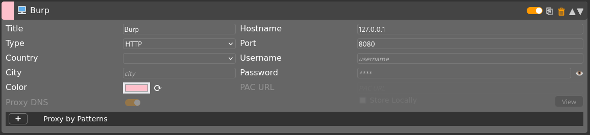
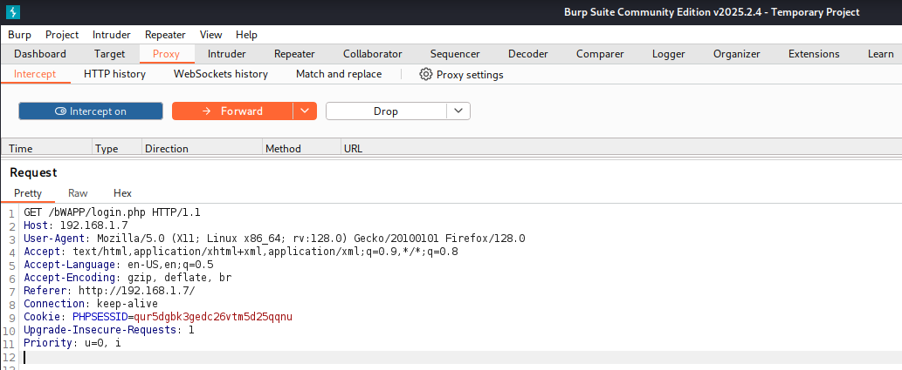
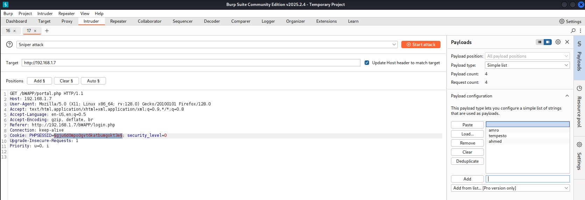
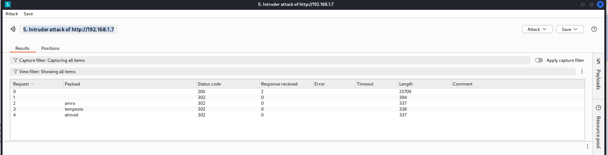

# Burp
- Burp Suite is a popular integrated platform used by cybersecurity professionals for testing the security of web applications
- A proxy, in general, is an agent authorized to act for another, but in computing, a proxy server acts as an intermediary between your device and the internet, forwarding your requests and masking your IP address for privacy, security, or bypassing restrictions

## Setup
- login crdentials in bWAPP: **(user:bee pass:bug)**
- FoxyProxy,Cookie Manager

- every requests on localhost `127.0.0.1` will be forwarded `proxy` to **burpsuite** which port is `8080`
- `http://192.168.1.7/bWAPP/login.php`
- `burpsuite`

```bash
POST /bWAPP/login.php HTTP/1.1
Host: 192.168.1.7
User-Agent: Mozilla/5.0 (X11; Linux x86_64; rv:128.0) Gecko/20100101 Firefox/128.0
Accept: text/html,application/xhtml+xml,application/xml;q=0.9,*/*;q=0.8
Accept-Language: en-US,en;q=0.5
Accept-Encoding: gzip, deflate, br
Content-Type: application/x-www-form-urlencoded
Content-Length: 51
Origin: http://192.168.1.7
Connection: keep-alive
Referer: http://192.168.1.7/bWAPP/login.php
Cookie: PHPSESSID=ji92hno3vrt8fcuoumfhfqgbmc; security_level=0
Upgrade-Insecure-Requests: 1
Priority: u=0, i

login=bee&password=bug&security_level=0&form=submit
```
- We can modify this request , or inject something malicious then forward and we can also drop

### Repeater
- Proxy captures and intercepts live traffic, while Repeater lets you resend and modify a single request manually as many times as you want for testing.
- Repeater lets you test the same request manually without needing to browse or refresh the page each time.
- right click -> send to repeater

### Intruder
- Intruder is used to automate attacks by sending many different payloads quickly — like fuzzing, brute forcing, or parameter testing.
- right click -> send to intruder

## WalkThrough in Burpsuite
#### Intercept is on and proxy is forwarded to port 8080 burpsuite

- old cookie `Cookie: PHPSESSID=ji92hno3vrt8fcuoumfhfqgbmc`
- credentials `login=bee&password=bug&security_level=0&form=submit`
```bash
POST /bWAPP/login.php HTTP/1.1
Host: 192.168.1.7
User-Agent: Mozilla/5.0 (X11; Linux x86_64; rv:128.0) Gecko/20100101 Firefox/128.0
Accept: text/html,application/xhtml+xml,application/xml;q=0.9,*/*;q=0.8
Accept-Language: en-US,en;q=0.5
Accept-Encoding: gzip, deflate, br
Content-Type: application/x-www-form-urlencoded
Content-Length: 51
Origin: http://192.168.1.7
Connection: keep-alive
Referer: http://192.168.1.7/bWAPP/login.php
Cookie: PHPSESSID=ji92hno3vrt8fcuoumfhfqgbmc; security_level=0
Upgrade-Insecure-Requests: 1
Priority: u=0, i

login=bee&password=bug&security_level=0&form=submit
```
---
#### After login i got this h

- Cookie after logging `Cookie: PHPSESSID=gju6d0mpo0gvt6katbumgokt3e; security_level=0`
```bash
GET /bWAPP/portal.php HTTP/1.1
Host: 192.168.1.7
User-Agent: Mozilla/5.0 (X11; Linux x86_64; rv:128.0) Gecko/20100101 Firefox/128.0
Accept: text/html,application/xhtml+xml,application/xml;q=0.9,*/*;q=0.8
Accept-Language: en-US,en;q=0.5
Accept-Encoding: gzip, deflate, br
Referer: http://192.168.1.7/bWAPP/login.php
Connection: keep-alive
Cookie: PHPSESSID=gju6d0mpo0gvt6katbumgokt3e; security_level=0
Upgrade-Insecure-Requests: 1
Priority: u=0, i
```
---
#### Right Click then send to Intruder
- add different payloads `(amro,tempesto,ahmed)` and see results
- let\`s select PHPSESSID value then `Add` payloads

- Start attack

- The HTTP `200 OK` successful response status code indicates that a request has succeeded
- The HTTP `302 Found` redirection response status code indicates that the requested resource has been temporarily moved to the URL in the Location header
- Try another payload `Cookie: PHPSESSID=gju6d0mpo0gvt6katbumgokt3e; security_level=0` let\`s select `0` of the `security_level`


